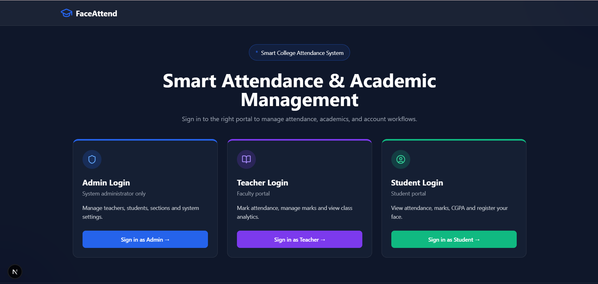
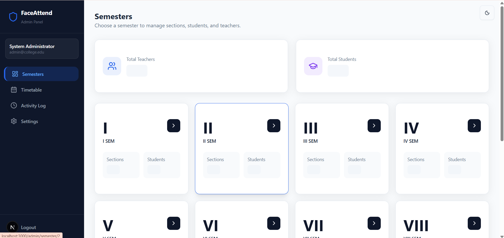
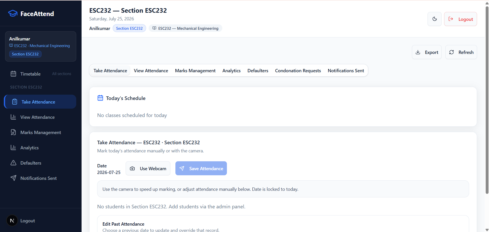
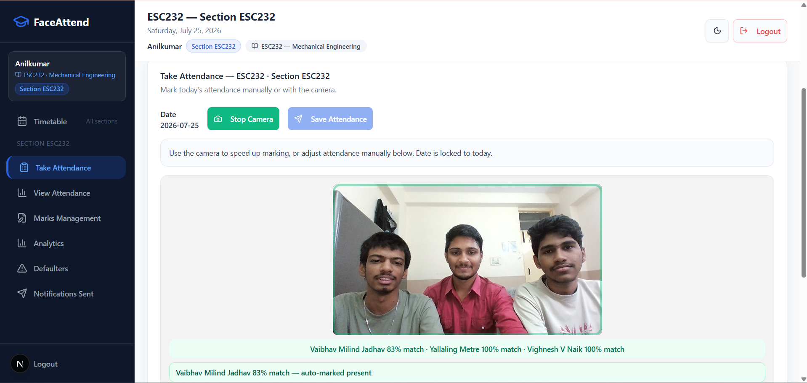
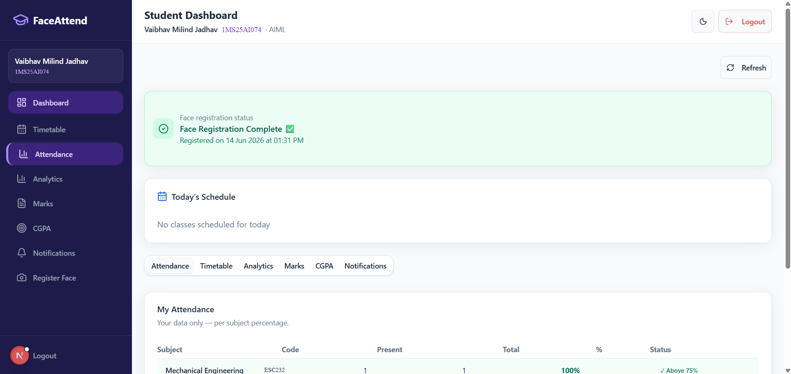
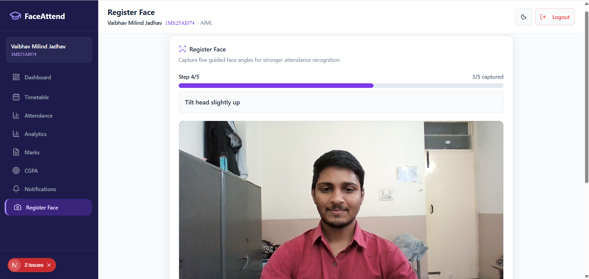

<div align="center">



# 🎓 FaceAttend — Frontend

### AI-Powered Smart Attendance & Academic Management Platform

[](https://nextjs.org/)
[](https://www.typescriptlang.org/)
[](https://tailwindcss.com/)
[](https://react.dev/)
[](LICENSE)

**Backend Repo →** [FaceAttend-Backend](https://github.com/vighneshnaik2007/FaceAttend-Backend)

</div>

---

## 📌 Overview

FaceAttend is a full-stack AI-based attendance system built for college classrooms. This repository contains the **Next.js frontend** — a multi-role web application with three separate portals for Admins, Teachers, and Students.

Teachers can mark attendance using **real-time face recognition via webcam**, view analytics, manage marks, and handle condonation requests — all from one dashboard. Students can track their own attendance, view marks, check CGPA, and register their face. Admins manage the entire institution structure.

Built as an **IPBL (Interdisciplinary Project Based Learning) semester project** at M S Ramaiah Institute of Technology, Bengaluru.

---

## 📸 Screenshots

<table>
  <tr>
    <td align="center"><strong>Landing Page</strong></td>
    <td align="center"><strong>Admin — Semesters</strong></td>
  </tr>
  <tr>
    <td></td>
    <td></td>
  </tr>
  <tr>
    <td align="center"><strong>Teacher — Take Attendance</strong></td>
    <td align="center"><strong>Face Recognition Live</strong></td>
  </tr>
  <tr>
    <td></td>
    <td></td>
  </tr>
  <tr>
    <td align="center"><strong>Student Dashboard</strong></td>
    <td align="center"><strong>Face Registration</strong></td>
  </tr>
  <tr>
    <td></td>
    <td></td>
  </tr>
</table>

---

## ✨ Features

### 🔐 Multi-Role Authentication
- Three independent portals — Admin, Teacher, Student
- Email/USN + password login with forgot password via OTP
- Session persistence via localStorage with role-based route guards

### 👨‍🏫 Teacher Portal
- **Real-time face recognition attendance** — open webcam, system auto-identifies and marks students present
- Manual attendance with bulk-submit fallback
- Edit past attendance records
- Marks management — CIE1, CIE2, Assignment, SEE entry with validation
- Analytics — bar charts, line trend charts, pie charts (regular vs shortage)
- Defaulter tracking with prediction ("student needs X more classes to reach 75%")
- Condonation request approval/rejection with remarks
- PDF & Excel export for attendance and marks
- Shortage alert email log

### 🎓 Student Portal
- Per-subject attendance percentage with shortage warnings
- Attendance prediction ("you can miss X more classes")
- CIE/SEE marks table with grade and grade points
- CGPA display with subject-wise breakdown
- 5-angle face registration (straight, left, right, up, down)
- Condonation request submission with document upload
- Weekly timetable with live status (upcoming/ongoing/completed)
- Shortage alert email history

### 🛡️ Admin Portal
- Manage semesters I–VIII with sections
- CRUD operations for teachers and students per section
- Full timetable management (create/edit/delete entries, mark holidays)
- Admin audit trail (activity log of all CRUD actions)
- System info and settings

---

## 🛠️ Tech Stack

| Layer | Technology |
|-------|-----------|
| Framework | Next.js 16.2 (App Router) |
| Language | TypeScript 5.7 (strict mode) |
| UI Library | shadcn/ui (New York style, 55+ components) |
| Styling | Tailwind CSS v4 + CSS variables |
| Icons | Lucide React |
| Charts | Recharts |
| Forms | React Hook Form + Zod |
| Date Handling | date-fns + React Day Picker |
| Notifications | Sonner (toast) |
| Dark Mode | next-themes |
| Package Manager | pnpm |
| Build Tool | Turbopack (dev) |

---

## 📁 Project Structure

```
FaceAttend---frontend/
├── app/
│   ├── layout.tsx              # Root layout — AuthProvider + ThemeProvider
│   ├── page.tsx                # Landing page — 3 role cards
│   ├── admin/                  # Admin portal (login, dashboard, semester, timetable)
│   ├── teacher/                # Teacher portal (login, dashboard with 7 tabs)
│   └── student/                # Student portal (login, dashboard with 6 tabs, register-face)
├── components/
│   ├── ui/                     # 55+ shadcn/ui components
│   ├── teacher/                # Teacher sidebar + header
│   ├── student/                # Student sidebar + header + condonation modal
│   ├── admin/                  # Admin sidebar
│   └── timetable/              # Shared timetable grid + today schedule widget
├── lib/
│   ├── api.ts                  # All API calls to Flask backend (832 lines, 60+ endpoints)
│   ├── auth-context.tsx        # AuthContext + AuthProvider + useAuth hook
│   └── types.ts                # Shared TypeScript domain types
├── hooks/
│   ├── use-toast.ts
│   ├── use-mobile.ts
│   └── use-minimum-loading.ts
└── .env.local                  # Environment variables
```

---

## 🚀 Getting Started

### Prerequisites

- Node.js 18+
- pnpm (`npm install -g pnpm`)
- FaceAttend Backend running at `http://localhost:5000`

### Installation

```bash
# Clone the repository
git clone https://github.com/vighneshnaik2007/FaceAttend---frontend.git
cd FaceAttend---frontend

# Install dependencies
pnpm install

# Copy environment file
cp .env.local.example .env.local
```

### Environment Variables

Create a `.env.local` file in the root with the following:

| Variable | Description | Example |
|----------|-------------|---------|
| `NEXT_PUBLIC_API_URL` | Flask backend base URL | `http://localhost:5000` |

```env
NEXT_PUBLIC_API_URL=http://localhost:5000
```

### Running the Development Server

```bash
pnpm dev
```

Open [http://localhost:3000](http://localhost:3000) in your browser.

> ⚠️ Make sure the backend server is running first at `localhost:5000` before starting the frontend.

### Building for Production

```bash
pnpm build
pnpm start
```

---

## 📜 Available Scripts

| Command | Description |
|---------|-------------|
| `pnpm dev` | Start development server with Turbopack |
| `pnpm build` | Build for production |
| `pnpm start` | Start production server |
| `pnpm lint` | Run ESLint |

---

## 🌐 Role-Based Navigation

| Role | Login Route | Dashboard |
|------|-------------|-----------|
| Admin | `/admin/login` | `/admin/dashboard` |
| Teacher | `/teacher/login` | `/teacher/dashboard?section=` |
| Student | `/student/login` | `/student/dashboard?tab=` |

---

## 👨‍💻 Team

Built by a 5-member team as part of the **IPBL Semester Project** at **M S Ramaiah Institute of Technology, Bengaluru (VTU-affiliated)**.

| Name | GitHub |
|------|--------|
| Vighnesh V Naik | [@vighneshnaik2007](https://github.com/vighneshnaik2007) |
| Vaibhav Milind Jadhav | [@vaibhavjadhav0210](https://github.com/vaibhavjadhav0210) |
| Yallaling Metre | — |
| Vinaykumar | — |
| Yathin Gowda P | — |

---

## 🔗 Related

- 🔧 **Backend Repository:** [FaceAttend-Backend](https://github.com/vighneshnaik2007/FaceAttend-Backend)
- 👤 **GitHub:** [vighneshnaik2007](https://github.com/vighneshnaik2007)

---

## 📄 License

This project is licensed under the MIT License — see the [LICENSE](LICENSE) file for details.

---

<div align="center">
  <sub>Built with ❤️ at MSRIT, Bengaluru | IPBL 2026</sub>
</div>
